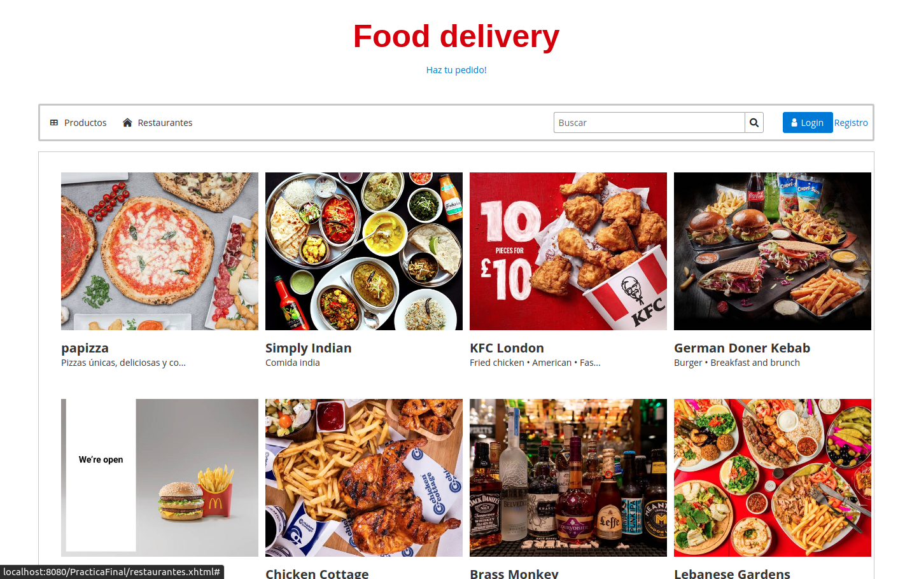
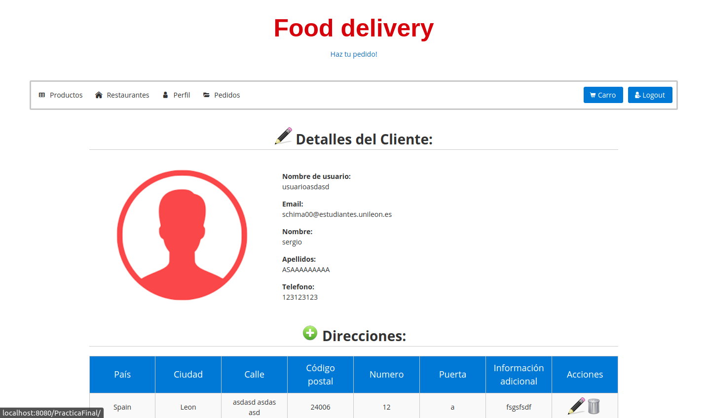
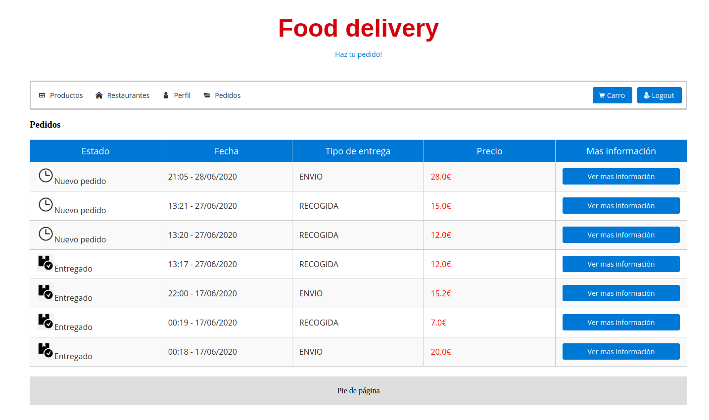
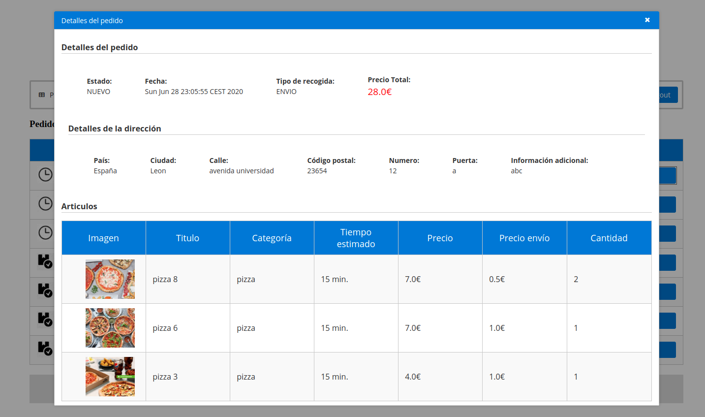
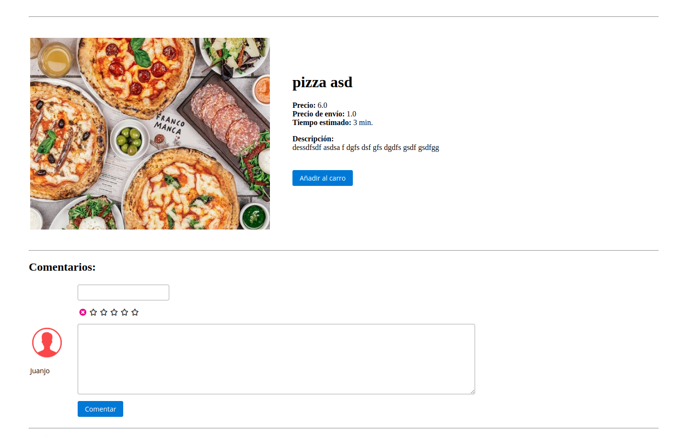
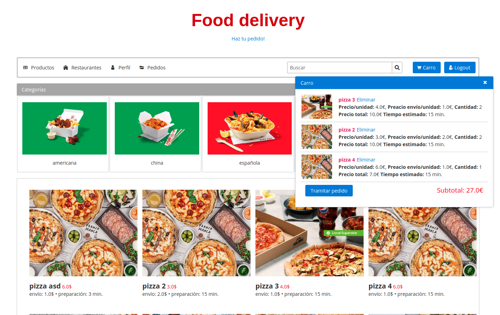
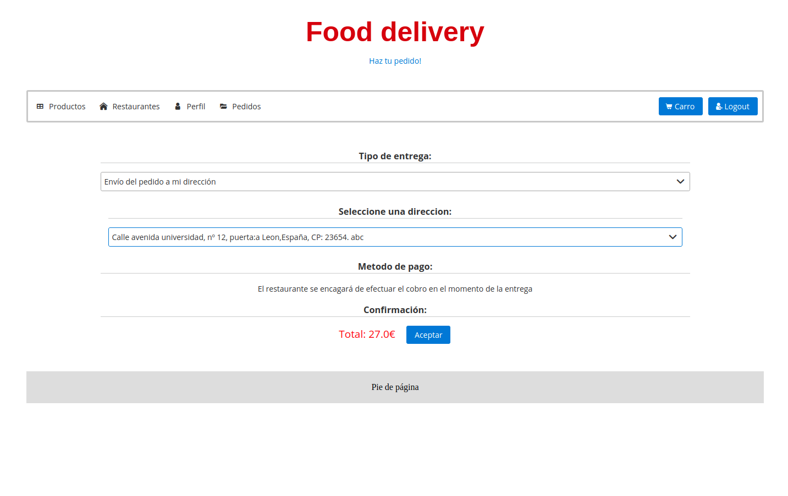
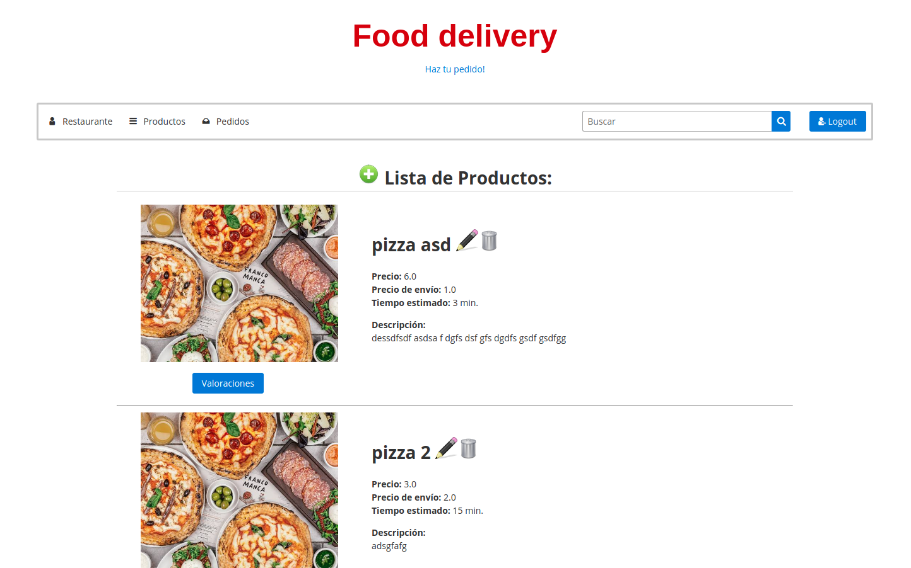
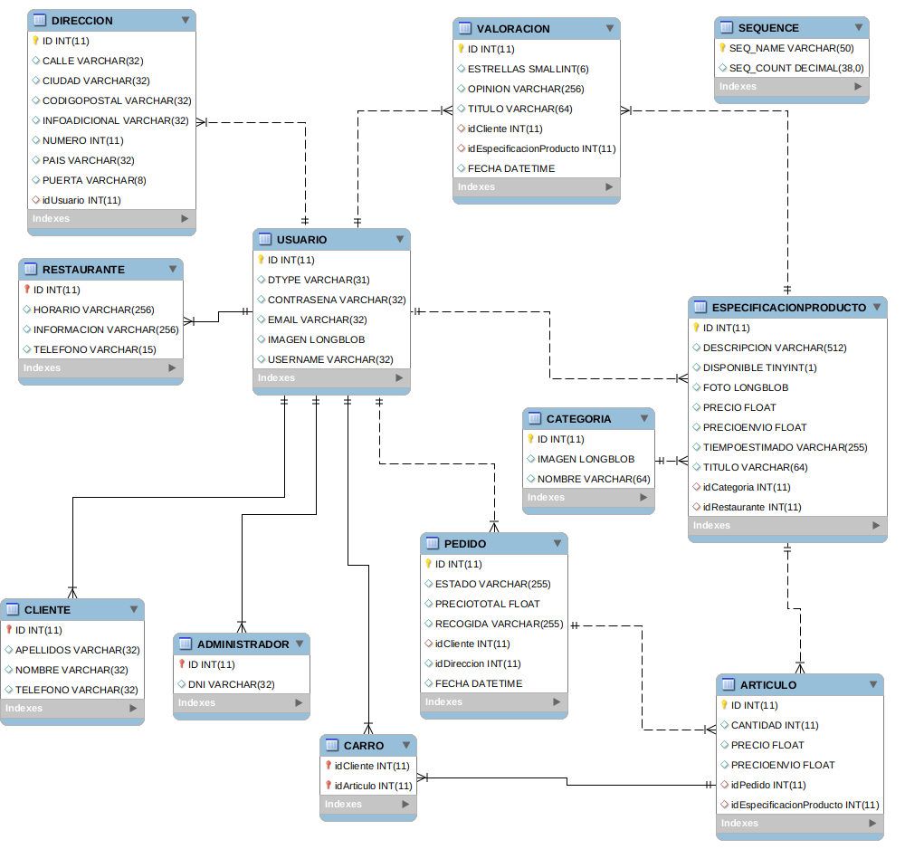

# Food Delivery
(proyecto realizado en julio de 2020)
 
Consiste en una web de pedidos de comida a domicilio
  
Tecnologías utilizadas: Java, JSF, Primefaces, Omnifaces, EJB, JPA
 Probado en un servidor Payara

## Algunas capturas

---

---

---

---

---

---

---

---

 

## Base de datos

